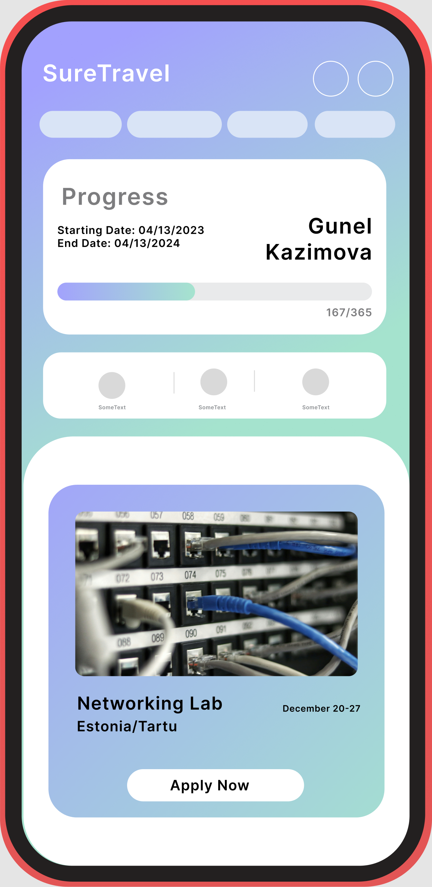

# SureTravel

## What is SureTravel?
SureTravel is an idea that aims to increase appeal of citizens to buy life insurance. We believe that providing award mechanism into Insurance system by integrating yearly health goals will increase peoples motivation to usage of life insurance. We will come up with some workshops and holidays inside or outside of country. The users which can stay healthy up to targeted year will have a chance to get benefit from these events. **Only the health issues that can affect to the life Insurance will included.**

### How SureTravel will implement this idea?
We are working on a MVP for this idea on IOS platform. This app will show up variable events to the users and the users that reach the target will easily apply this programs.

## Features of SureTravel
- Easy Access from current PashaLife mobile application
- Progress bar for tracking healthy days' duration.
- Suggestions for possible events
- Algorithm that chooses the best events for each individual
- Permanent and ... events

_Events depend on organizations arrangements._

## Draft Version of our UI 

